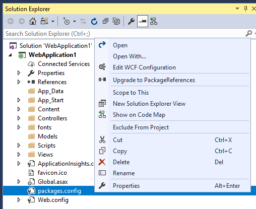

# NuGet PackageReference Upgrader

<!-- Replace this badge with your own-->

<!-- Update the VS Gallery link after you upload the VSIX-->
Download this extension from the [VS Marketplace](https://marketplace.visualstudio.com/items?itemName=CloudNimble.NuGetPackageReferenceUpgrader)
or get the [CI build](http://vsixgallery.com/extension/bae2a4ae-be17-4f34-be32-f7f103918589/).

---------------------------------------

Upgrades Visual Studio 2017 projects to use PackageReferences instead of packages.config, streamlining package resolution and eliminating errors.

See the [change log](CHANGELOG.md) for changes and road map.

## Features

- Upgrades VS2017 projects by moving NuGet package references into the project file itself.

### Project Upgrade:
- Creates a backup of your packages.config and project file for safekeeping.
- Cycles through your packages.config file for your existing references.
- Removes the legacy package-relative DLL references.
- Removes legacy .targets import nodes, as PackageReferences handle them transparently.
- Removes legacy error conditions.

## Contribute
Check out the [contribution guidelines](CONTRIBUTING.md)
if you want to contribute to this project.

For cloning and building this project yourself, make sure
to install the
[Extensibility Tools](https://visualstudiogallery.msdn.microsoft.com/ab39a092-1343-46e2-b0f1-6a3f91155aa6)
extension for Visual Studio which enables some features
used by this project.

## License
[Apache 2.0](LICENSE)
